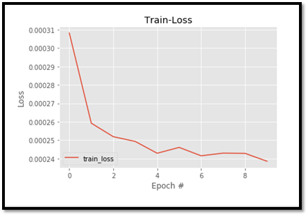
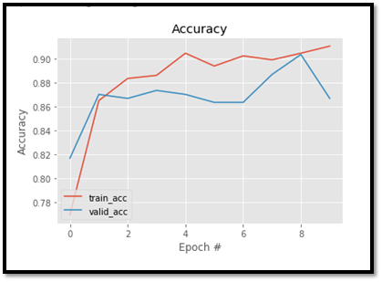

## Android Application for Fire-Smoke prediction 
Detecting Fire, Smoke using Computer Vision, Open CV and PyTorch using deep learning concept 
Early fire/smoke detection plays a very important role in protecting many lives also property loss can be reduced and downtime for the operation minimized through early detection. Therefore in this project I have developed an Computer Vision & Deep Learning pipeline for fire and smoke detection.

android application which predict the fire and smoke.

## Problem Statement 
To build an android application that can detect fire and smoke in an image.The image can be either taken from gallery or capture a new image using camera.Colored bounding box has
to be drawn on the image once the fire or smoke is detected as shown in below image 

## development process

development process is 4 types 
  
 1)Data Collection

<ul>
     <li> Data – Image type </li> 
      <li> Fire </li>
      <li> Smoke</li>
      <li> Neutral</li>
  </ul>

2)Model Training using Teachable ML by Google
 

3)Export Model to local system

4)Integrate to Android Application & testing

## Dataset Features
 1)Trainning dataset has 3 classes
<ul>
      <li> Fire has 1000 images  </li>
      <li> Smoke  has 1000 images</li>
      <li> Neutral  has 1000 images</li>
  </ul>
  
  
 2)Testing dataset has 3 classes
 <ul>
      <li> Fire has 100 images  </li>
      <li> Smoke  has 100 images</li>
      <li> Neutral  has 100 images</li>
  </ul>
  

  
 
## Requirements
<ul>
      <li> Python3  </li>
      <li> Pytorch</li>
      <li> OpenCv</li>
      <li> Matplotlib  </li>
      <li> Numpy</li>
      <li> Tensor Flow Lite</li>
  <li> Android Studio </li>
  </ul>

## Implementation
Fire-Smoke detection.Detecting Fire, Smoke using Computer Vision, Open CV and PyTorch .Early fire/smoke detection plays a very important role in protecting many lives also property loss can be reduced and downtime for the operation minimized through early detection. Therefore in this project I have developed an Computer Vision & Deep Learning pipeline for fire and smoke detection.

## Model Structure 
 

  teachable ML by Google is trained the model got the model files and it dump in android studio

 
For training the model I have used transfer learning technique. Architecture used here is ResNet50 which is pretrained on ImageNet dataset. I have achieved validation accuracy   more than 95% using ResNet. training and graphs – ( Training.ipynb and Interference.ipynb)

  
number  of Epoches=10 

 Result of training where epoch = 10

 
number  of Epoches=100 

 
 
 Result of training where epoch = 100

 
 
## Image output 
you can give any images to model.

## video output
it also predict video based on input,if user give a video it will predict probability of input video is Fire,Smoke or Neutral.
<video width="100" height="100" controls>
<source src="vid.mp4" type ="video/mp4">
</video>

 
## Android Application 

it is real time fire-smoke detection application instead of making boxes it seems not good so that i made scolldown activity.its clearly visible to user.In real-time application its help to everyone.

## Results

Click the below link for Fire-smoke prediction app video....

https://user-images.githubusercontent.com/76401812/102762490-5c750a00-439e-11eb-9448-e285de5f754d.mp4

https://user-images.githubusercontent.com/76401812/102758170-5aa84800-4398-11eb-8f52-a6747641c199.gif

## Proving security to app
<ul>
      <li> Register</li>
      <li> Login</li>
      <li> Default Login</li>
      <li> 2 Factor Authentication</li>
      <li> Logout</li>
  </ul>
  
  
 Click the below link for above factors in application

  
https://user-images.githubusercontent.com/76401812/102770421-23db2d80-43aa-11eb-8c96-17da303a60ee.mp4

  

